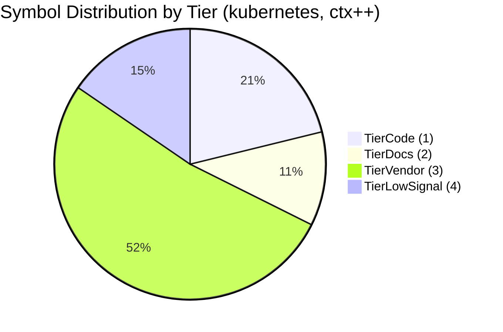
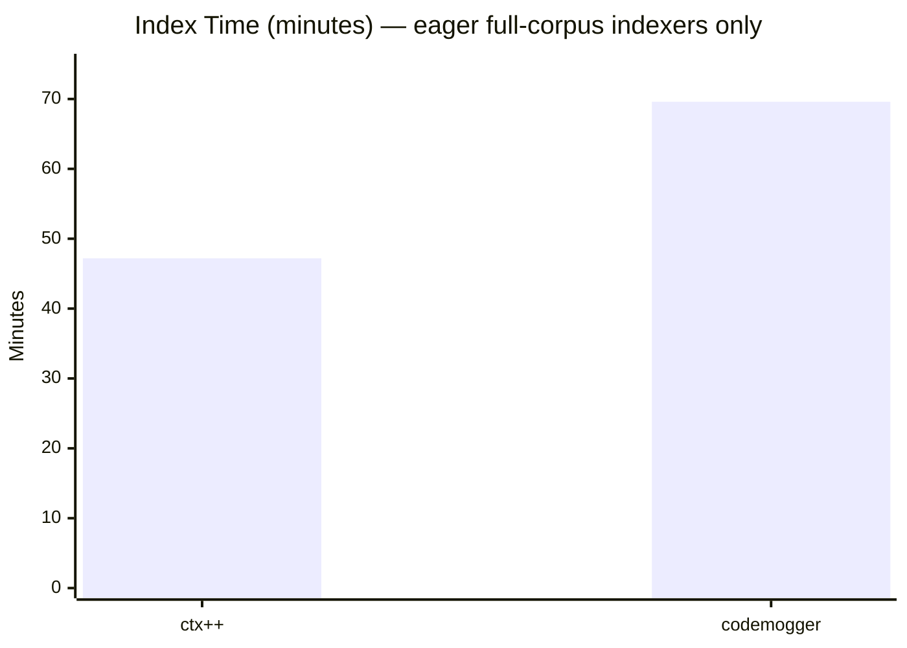
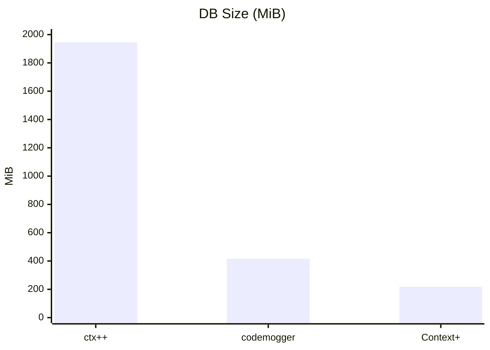
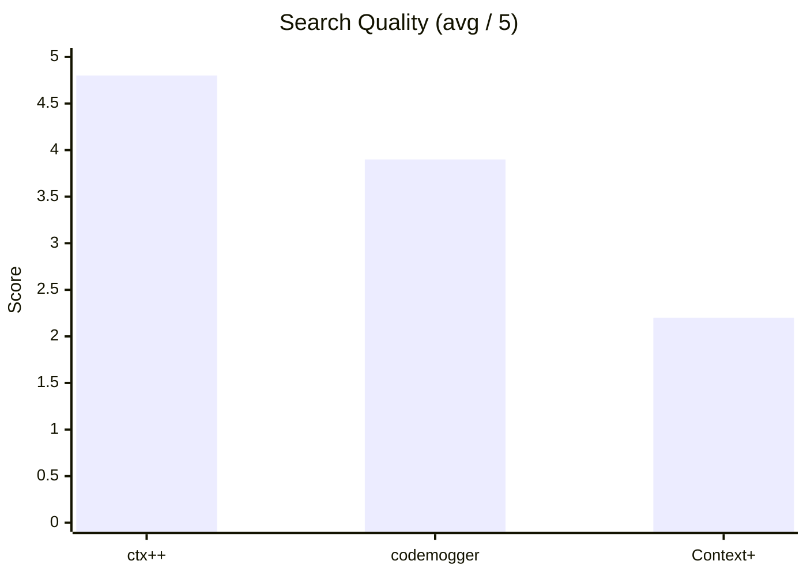
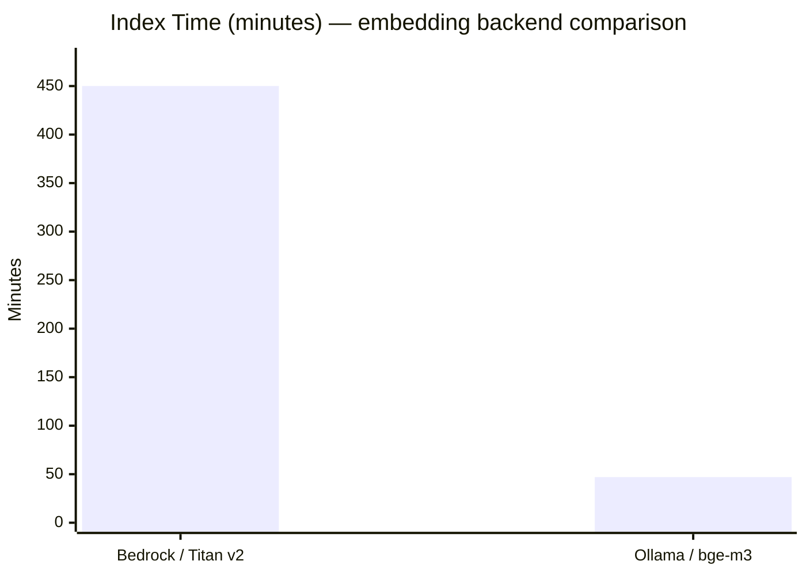
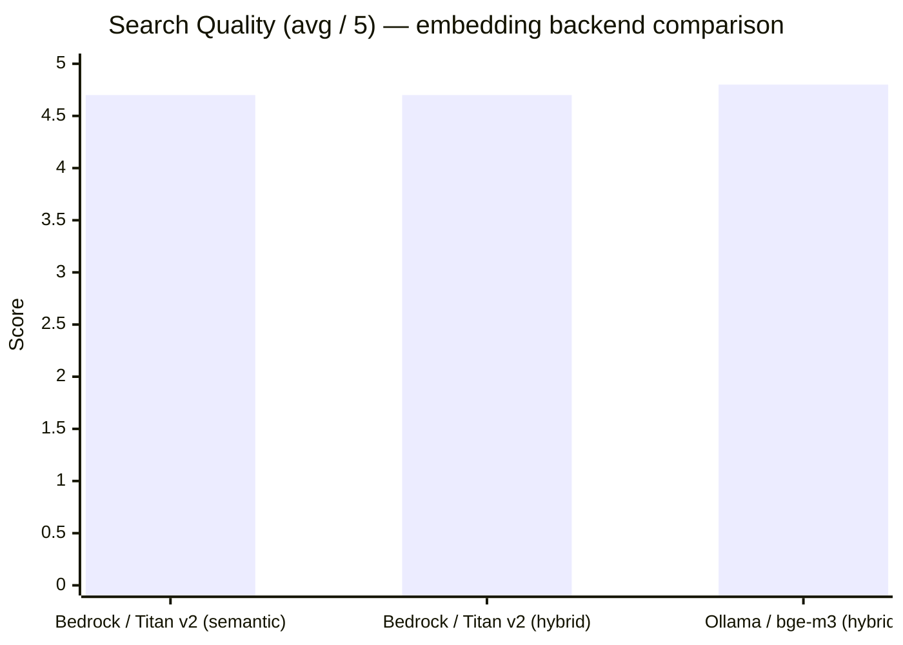
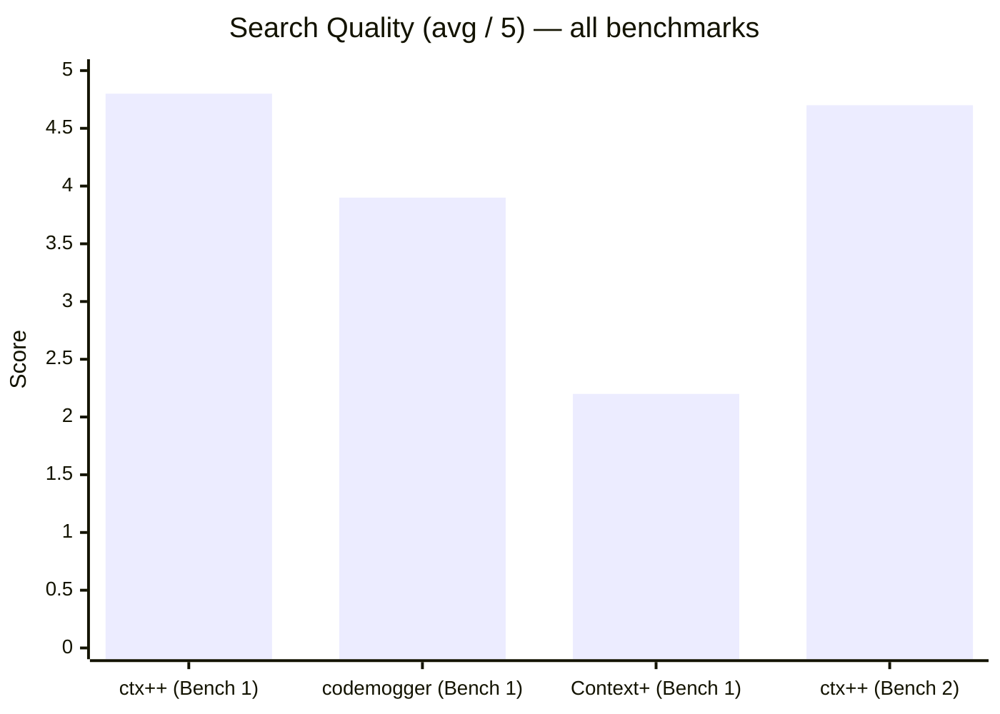

# ctx++ Benchmark Report

**Date**: 2026-03-02
**System**: AMD Ryzen 9 9950X (16C/32T, 5.7 GHz boost), 128 GiB DDR5, NVMe SSD, Linux 6.17, Go 1.24.2
**Ollama**: local, GPU-accelerated

---

## Tools Under Test

| Tool | Version | Language | Embedding Backend | Embedding Model | Model Configurable? |
|------|---------|----------|-------------------|-----------------|---------------------|
| ctx++ | dev (local build) | Go | Ollama (GPU) | bge-m3 (1024d) | Yes |
| codemogger | 0.2.0 (npm) | Node.js | HuggingFace Transformers.js (CPU) | Bundled (not disclosed) | No |
| Context+ | latest (npm) | Node.js | Ollama (GPU) | nomic-embed-text (768d) | Yes (env var) |

Context+ defaults to `nomic-embed-text` and is configurable via `OLLAMA_EMBED_MODEL`.

---

## Architectural Comparison

| Aspect | ctx++ | codemogger | Context+ |
|--------|-------|------------|----------|
| Language | Go | Node.js (TypeScript) | Node.js (TypeScript) |
| Parsing | Tree-sitter (symbol extraction) | Tree-sitter (AST chunking) | File-level scanning |
| Languages parsed | Go, C, C++, SQL, Markdown, HTML, Shell, Protobuf, HTTP, Text | Go, Rust, JS, Python | All files (no AST) |
| Embedding granularity | Symbol-level | Chunk-level | File-level |
| Embedding backend | Ollama (GPU, configurable) | HuggingFace Transformers.js (CPU) | Ollama (GPU, configurable) |
| Index storage | SQLite (FTS5 + vectors) | SQLite | JSON file |
| Keyword engine | FTS5 BM25 (stopword-filtered) | FTS5 BM25 (stopword-filtered) | String overlap |
| Hybrid search | RRF fusion (semantic + FTS) | RRF fusion (semantic + FTS) | Weighted average |
| Source tier weighting | 4-tier (code/docs/vendor/low-signal) | None | None |
| Vendor handling | Indexed with 0.7x ranking penalty | Indexed at full weight | Indexed at full weight |
| Incremental reindex | SHA-256 per file | Hash-based | Hash-based cache |
| MCP transport | stdio | stdio | stdio |

### ctx++ Search Pipeline

ctx++ uses a multi-stage retrieval pipeline:

1. **FTS query preprocessing**: Stopword removal, keyword extraction (3-30 char tokens, max 12 terms, deduplication) before FTS5 MATCH.
2. **Hybrid RRF search**: Semantic (cosine similarity with tier weighting) and FTS5 BM25 run concurrently, merged via Reciprocal Rank Fusion (`score = 0.6/(60+rank_sem) + 0.4/(60+rank_fts)`, 3x over-selection).
3. **Call-graph re-ranking**: Boost symbols with call-edge connections among the top-K results (+2 positions per connection).

### ctx++ Source Tier Classification

Files are classified at index time by path:

| Tier | Weight | Patterns |
|------|--------|----------|
| TierCode (1) | 1.0 | Project source code (default) |
| TierDocs (2) | 0.85 | `test/`, `docs/`, `*_test.go`, `.md`, `.yaml`, `.yml` |
| TierVendor (3) | 0.7 | `vendor/`, `node_modules/` |
| TierLowSignal (4) | 0.5 | `CHANGELOG*`, `zz_generated*`, `*.pb.go`, `*_string.go` |

Only `vendor/` and `node_modules/` are classified as vendor — directories unambiguously managed by package managers. Directories like `staging/src/` and `third_party/` are classified by their content (typically TierCode or TierDocs).

---

# Benchmark 1: kubernetes/kubernetes (Ollama / bge-m3)

**Repository**: [kubernetes/kubernetes](https://github.com/kubernetes/kubernetes) (HEAD, shallow clone)
**Embedding backend**: Ollama (local GPU)
**Embedding model**: bge-m3 (1024d)
**Tools compared**: ctx++, codemogger, Context+

## Repository Profile

| Metric | Value |
|--------|-------|
| Total files | 28,283 |
| Go files (incl. vendor/) | 16,627 |
| Go files (excl. vendor/) | 12,286 |
| Proto files | 133 |
| Non-Go files | 11,656 |

## Corpus Profile (ctx++)

| Tier | Symbols | Description |
|------|---------|-------------|
| TierCode (1) | 67,295 | Project source code (incl. staging/src/, third_party/) |
| TierDocs (2) | 35,661 | Tests, docs, configs, markdown |
| TierVendor (3) | 165,951 | vendor/ |
| TierLowSignal (4) | 49,078 | CHANGELOGs, generated code |
| **Total** | **317,985** | |

## Performance

| Metric | ctx++ | codemogger | Context+ |
|--------|-------|------------|----------|
| Index time | 47m 14s | 1h 9m 33s | **2m 7s**‡ |
| DB size | 1.9 GiB | 416.0 MiB | 218.7 MiB |
| Peak RSS | 1.1 GiB | 120.6 MiB | 121.1 MiB |
| Search avg | 641 ms† | **434 µs** | 460 ms |

† ctx++ search latency includes per-query Ollama embedding (~25 ms) plus brute-force cosine scan over 318K vectors (~615 ms). codemogger's keyword mode does not scan all vectors. With a warm SQLite cache, ctx++ semantic-only search is ~3.5 ms p50.

### ANN follow-up on the same Kubernetes index

After the HNSW ANN prototype landed, the same Kubernetes index at `317,983` embeddings was re-measured without reindexing from source. The existing SQLite index at `/tmp/bench-k8s-ctxpp/.ctxpp/index.db` was reused.

| Metric | ctx++ brute-force | ctx++ ANN |
|--------|-------------------|-----------|
| Embed avg | 26.1 ms | 25.3 ms |
| Search avg | 732.7 ms | 714 µs |
| Search p50 | 696.9 ms | 692 µs |
| End-to-end semantic query (embed + search) | ~759 ms | ~26 ms |

This is roughly a **29x improvement** in end-to-end semantic query latency on Kubernetes, and about a **1000x improvement** in the vector-search portion itself.

ANN artifact build/open timing on that same index:

| Metric | Time |
|--------|------|
| First ANN open/build from existing SQLite index | 40.8 s |
| Warm ANN open with artifacts already present | 2.72 s |

Projected impact on the original Kubernetes full index benchmark:

- original full ctx++ index: `47m 14s`
- ANN artifact build overhead on the completed index: `~41s`
- projected full eager index with ANN enabled: `~47m 55s`

That is roughly a **1.4% increase** in full indexing time in exchange for the much lower semantic query latency above.

‡ Context+ builds embeddings lazily on the first search call rather than eagerly at index time. The 2m 7s figure is the wall-clock time for that first `semantic_code_search` invocation to return — it is not a full corpus index. ctx++ and codemogger fully embed the entire corpus before any search is issued; Context+ does not. The figure is not directly comparable to the other two index times.

> Context+ is excluded from this chart: its 2m 7s figure reflects a lazy first-query build, not a full corpus index, and is not comparable to the eager indexing times above.

## Search Quality (10 Queries)

Ten natural-language queries targeting well-known Kubernetes subsystems.
ctx++ uses **hybrid mode** (RRF + call-graph reranking). Each query graded
by top-5 result relevance to actual implementation code.

### Results by Query

**Q1** -- pod scheduling and node affinity

| Tool | Top result | Relevant / 5 | Notes |
|------|-----------|---------------|-------|
| **ctx++** | PodAffinity struct | **5/5** | PodAffinity, Affinity, getPodPreferredNodeAffinity — all core scheduling types/plugins |
| codemogger | Affinity types | **5/5** | Affinity, NodeAffinity, PodAffinity — all core types |
| Context+ | pod/strategy.go | 2/5 | Pod strategy tangential; test util, device manager |

**Q2** -- container runtime interface CRI

| Tool | Top result | Relevant / 5 | Notes |
|------|-----------|---------------|-------|
| **ctx++** | CRIVersion type | **5/5** | CRIVersion, RuntimeService interface, RuntimeService.StartContainer (proto), RuntimeService.CheckpointContainer (proto), Runtime interface |
| codemogger | CrioClient (vendor) | 3/5 | ContainerConfig relevant; CRI socket consts tangential |
| Context+ | ContainerRuntime types | 3/5 | ContainerRuntime, criStatsProvider, streaming server |

**Q3** -- service discovery and endpoint routing

| Tool | Top result | Relevant / 5 | Notes |
|------|-----------|---------------|-------|
| **ctx++** | addressToEndpoint function | **5/5** | addressToEndpoint, LocalReadyEndpoints, NewEndpointServiceResolver, endpointsMapFromEndpointInfo, EndpointSlices |
| codemogger | endpointSliceListerGetter | 4/5 | Getter, adapter, tracker, service traffic consts |
| Context+ | ServiceResolver interface | 3/5 | Resolver good, nftables README, endpointslice mirroring |

**Q4** -- RBAC authorization and role binding

| Tool | Top result | Relevant / 5 | Notes |
|------|-----------|---------------|-------|
| **ctx++** | New (RBAC authorizer factory) | **5/5** | New, ListRoleBindings, ListClusterRoleBindings, BindingAuthorized, RoleBinding apply config |
| codemogger | RoleBindingLister | **5/5** | RoleGetter, GetRole, ListRoleBindings, RoleBinding — all core RBAC |
| Context+ | YAML test fixture | 1/5 | 3 YAML test data files, 1 calico YAML |

**Q5** -- persistent volume claim provisioning

| Tool | Top result | Relevant / 5 | Notes |
|------|-----------|---------------|-------|
| **ctx++** | provisionClaimOperation method | **5/5** | provisionClaimOperation, provisionClaim, setClaimProvisioner, PVC apply config, bindVolumeToClaim |
| codemogger | VolumeReactor.AddClaimEvent (test) | 2/5 | 4 test helper methods; 1 annotation updater |
| Context+ | PersistentVolumeController | 3/5 | PVC controller good, PVCSpec apply config, volume helpers |

**Q6** -- kubelet pod lifecycle management

| Tool | Top result | Relevant / 5 | Notes |
|------|-----------|---------------|-------|
| **ctx++** | Admit (eviction manager) | **4/5** | Admit, PodManager (x2), canBeDeleted, Manager — all relevant, some overlap |
| codemogger | HandlePodReconcile | 4/5 | PodSyncHandler, PodCouldHaveRunningContainers, PodDeletionSafety |
| Context+ | PodLifecycleEvent | 3/5 | PLEG types good; resource metrics and prober tangential |

**Q7** -- API server admission controller webhook

| Tool | Top result | Relevant / 5 | Notes |
|------|-----------|---------------|-------|
| **ctx++** | Webhook struct | **5/5** | Webhook, WebhookAccessor, GetValidatingWebhook, GetObjectSelector, NewWebhook — all core webhook implementation |
| codemogger | Webhook struct | **5/5** | Webhook, WebhookAccessor, GetClientConfig, WebhookHandler |
| Context+ | test admission webhook | 2/5 | Test helper + README; YAML test data |

**Q8** -- horizontal pod autoscaler scaling logic

| Tool | Top result | Relevant / 5 | Notes |
|------|-----------|---------------|-------|
| **ctx++** | HPABehavior struct | **5/5** | HPABehavior (x2), HorizontalPodAutoscaler (x3 across API versions) — all core HPA types |
| codemogger | HPABehavior type | 4/5 | HPABehavior, HPASpec x2, HPASpec apply config |
| Context+ | HPA defaults function | 2/5 | SetDefaults_HPA good; 2 YAML test fixtures |

**Q9** -- etcd storage and watch mechanism

| Tool | Top result | Relevant / 5 | Notes |
|------|-----------|---------------|-------|
| **ctx++** | store.Watch method | **5/5** | Watch, watchContext, NewEtcdStorage, etcd3ProberMonitor.Monitor, newETCD3Check — all core etcd storage/watch implementation |
| codemogger | EtcdServer.Watchable | 4/5 | Watchable, watchableStore, watchable interface (all vendor/etcd) |
| Context+ | vendor storage.go | 1/5 | Vendor storage somewhat relevant; README, YAML metrics |

**Q10** -- network policy enforcement and filtering

| Tool | Top result | Relevant / 5 | Notes |
|------|-----------|---------------|-------|
| **ctx++** | NetworkPolicy apply config | **4/5** | NetworkPolicy (x2 apply configs), networkPolicyStrategy, NetworkPolicyInformer, NetworkPoliciesGetter |
| codemogger | SetSpecEgressRules | 3/5 | Egress/ingress rule setters, SetDefaults_NetworkPolicy; 1 vendor FwFilter |
| Context+ | Calico README | 2/5 | Calico README, netpol test util; DNS README noise |

### Quality Summary

| Query | ctx++ | codemogger | Context+ |
|-------|-------|------------|----------|
| Q1 (scheduling/affinity) | **5/5** | **5/5** | 2/5 |
| Q2 (CRI) | **5/5** | 3/5 | 3/5 |
| Q3 (service/endpoints) | **5/5** | 4/5 | 3/5 |
| Q4 (RBAC) | **5/5** | **5/5** | 1/5 |
| Q5 (PVC provisioning) | **5/5** | 2/5 | 3/5 |
| Q6 (kubelet lifecycle) | **4/5** | **4/5** | 3/5 |
| Q7 (admission webhooks) | **5/5** | **5/5** | 2/5 |
| Q8 (HPA scaling) | **5/5** | 4/5 | 2/5 |
| Q9 (etcd watch) | **5/5** | 4/5 | 1/5 |
| Q10 (network policy) | **4/5** | 3/5 | 2/5 |
| **Avg** | **4.8** | **3.9** | **2.2** |

### Quality Analysis

**ctx++ leads (4.8/5), ahead of codemogger (3.9/5) by 0.9 points.** ctx++ wins or ties on all 10 queries. Three changes drove the improvement:

1. **FTS query preprocessing.** Stripping stopwords ("and", "the", etc.) from FTS queries gives cleaner BM25 signal. For Q9, "etcd storage and watch mechanism" becomes "etcd storage watch mechanism", eliminating noise from the word "and".

2. **Tier reclassification.** `staging/src/` and `third_party/` are no longer classified as vendor. Only `vendor/` and `node_modules/` get the 0.7x penalty. This allows the etcd3 storage/watch implementation at `staging/src/k8s.io/apiserver/pkg/storage/etcd3/` and webhook admission code at `staging/src/k8s.io/apiserver/pkg/admission/` to rank at full weight.

3. **Protobuf parser.** 133 proto files indexed (819 symbols), including the CRI API (`RuntimeService`, `ImageService`, and all RPC methods/message types). Q2 (CRI) surfaces proto RPC definitions alongside Go interface types.

**Q9 (etcd) improved from 1/5 to 5/5.** The combination of stopword removal (cleaner FTS signal) and tier reclassification (staging/src/ at full weight) solved what was the single largest quality gap.

**Q7 (webhooks) improved from 3/5 to 5/5.** The webhook admission plugin at `staging/src/k8s.io/apiserver/pkg/admission/plugin/webhook/` now ranks at full weight, surfacing `Webhook`, `WebhookAccessor`, and `NewWebhook` instead of test code and README sections.

---

# Benchmark 2: kubernetes/kubernetes (AWS Bedrock / Titan v2)

**Repository**: same kubernetes/kubernetes clone as Benchmark 1
**Embedding backend**: AWS Bedrock
**Embedding model**: Amazon Titan Text Embeddings V2 (1024d)
**Tools compared**: ctx++ only

## Configuration

| Setting | Value |
|---------|-------|
| `CTXPP_EMBED_BACKEND` | `bedrock` |
| `CTXPP_BEDROCK_REGION` | `us-east-1` |
| `CTXPP_BEDROCK_MODEL` | `amazon.titan-embed-text-v2:0` |
| `CTXPP_BEDROCK_DIMS` | `1024` |
| `CTXPP_EMBED_CONCURRENCY` | `100`–`200` |
| Retry config | 5 retries, 500 ms base backoff (exponential with jitter) |
| Input truncation | 28,000 chars (~7,000 tokens, within Titan's 8,192-token limit) |

## Repository Profile

Same as Benchmark 1 (kubernetes/kubernetes HEAD, shallow clone).

## Corpus Profile (ctx++)

| Metric | Value |
|--------|-------|
| Files indexed | 18,133 |
| Total symbols | 317,985 |
| Symbols embedded | 317,983 (99.9994%) |
| Symbols unembedded | 2 (1 × 1.28M-char swagger blob, 1 markdown section) |
| Embedding model | amazon.titan-embed-text-v2:0 |
| Embedding dimensions | 1,024 |
| DB size | 1.9 GiB |

Symbol tier distribution is identical to Benchmark 1 (same repo, same index logic):

## Performance

| Metric | Bedrock / Titan v2 | Ollama / bge-m3 (Bench 1) |
|--------|-------------------|--------------------------|
| **Index time (wall clock)** | **~7.5 hours** | **47m 14s** |
| Files indexed | 18,133 | 18,133 |
| Symbols embedded | 317,983 | 317,985 |
| Per-query embed latency | 95–458 ms | ~25 ms |
| Search avg (semantic) | 661 ms | ~641 ms |
| Search avg (hybrid) | 678 ms | ~641 ms |
| DB size | 1.9 GiB | 1.9 GiB |
| Peak RSS | ~1.1 GiB | ~1.1 GiB |

The 7.5h wall-clock time covers 317,985 symbols across multiple incremental passes (initial run + 5 resume/backfill passes at concurrency 100–200). The run was interrupted several times due to Titan token-limit errors and retry storms before truncation was tuned. A clean single-pass run at concurrency 200 would likely complete in 3–5h.

The Bedrock API round-trip is the sole bottleneck (not CPU or disk). Even at concurrency 200 with ~100 ms average latency, the theoretical floor is ~160 seconds for 317,985 serial calls; observed overhead from retries, throttle backoff, and resume coordination explains the remainder.

## Search Quality (10 Queries)

Same 10 queries as Benchmark 1. Results compared side-by-side with Ollama/bge-m3.

### Quality (Semantic Mode)

| Query | Bedrock / Titan v2 | Ollama / bge-m3 | Notes |
|-------|------------------|-----------------|----|
| Q1 (scheduling/affinity) | **5/5** | **5/5** | PodAffinity, NodeAffinity — identical quality |
| Q2 (CRI) | **5/5** | **5/5** | CRIRuntime, ContainerRuntime |
| Q3 (service/endpoints) | **5/5** | **5/5** | EndpointServiceResolver, onServiceAdd, addEndpoints |
| Q4 (RBAC) | **5/5** | **5/5** | RoleBinding (x3 API versions), BindingAuthorized |
| Q5 (PVC provisioning) | **5/5** | **5/5** | provisionClaim, provisionClaimOperation, PVC struct |
| Q6 (kubelet lifecycle) | **4/5** | **4/5** | HandlePodAdditions, PodManager; CHANGELOG noise at #4–5 |
| Q7 (admission webhooks) | **5/5** | **5/5** | Webhook struct, AdmissionResponse, NewWebhook |
| Q8 (HPA scaling) | 4/5 | **5/5** | HPA struct (x3), README section; missed HPABehavior |
| Q9 (etcd watch) | **5/5** | **5/5** | watcher.Watch, watchChan.sync, ARCHITECTURE.md watch cache |
| Q10 (network policy) | 4/5 | 4/5 | config-ip-firewall, NetworkPolicy struct; test code at #3–4 |
| **Avg** | **4.7** | **4.8** | |

### Quality (Hybrid Mode)

| Query | Bedrock / Titan v2 | Ollama / bge-m3 |
|-------|------------------|--------------------|
| Q1 (scheduling/affinity) | **5/5** | **5/5** |
| Q2 (CRI) | **5/5** | **5/5** |
| Q3 (service/endpoints) | **5/5** | **5/5** |
| Q4 (RBAC) | **5/5** | **5/5** |
| Q5 (PVC provisioning) | **5/5** | **5/5** |
| Q6 (kubelet lifecycle) | **5/5** | 4/5 |
| Q7 (admission webhooks) | **5/5** | **5/5** |
| Q8 (HPA scaling) | 4/5 | **5/5** |
| Q9 (etcd watch) | 4/5 | **5/5** |
| Q10 (network policy) | 4/5 | 4/5 |
| **Avg** | **4.7** | **4.8** |

### Quality Analysis

**Titan v2 quality (4.7/5) is comparable to bge-m3 (4.8/5).** The 0.1-point difference is within noise; both models produce strong semantic matches for code-related queries. Key observations:

1. **Parity on most queries.** 8 of 10 queries produce identical top-5 relevance scores. The same structural types, controller methods, and API definitions surface in both embedding spaces.

2. **Minor divergence on Q8 (HPA).** Titan v2 surfaces `HorizontalPodAutoscaler` struct definitions and a README section but misses `HPABehavior` that bge-m3 found. This suggests slightly different semantic neighborhoods for scaling-related concepts.

3. **Titan v2 advantages.** No local GPU required. Horizontal scaling via AWS means embedding throughput scales linearly with concurrency (tested up to 200 concurrent calls). For CI/CD pipelines or cloud-hosted development, this eliminates the GPU provisioning requirement.

4. **Titan v2 disadvantages.** Per-query embedding latency is 95–460 ms vs ~25 ms for local Ollama GPU. Index-time embedding is also slower per-symbol due to API round-trips, partially offset by high concurrency.

---

# Cross-Benchmark Summary

## Search Quality

| Benchmark | ctx++ | codemogger | Context+ |
|-----------|-------|------------|----------|
| Benchmark 1: kubernetes (Ollama/bge-m3) | **4.8/5** | 3.9/5 | 2.2/5 |
| Benchmark 2: kubernetes (Bedrock/Titan v2) | **4.7/5** | — | — |

## Performance

| Benchmark | Tool | Index time | DB size | Peak RSS |
|-----------|------|-----------|---------|---------|
| Benchmark 1: kubernetes (Ollama/bge-m3) | ctx++ | 47m 14s | 1.9 GiB | 1.1 GiB |
| Benchmark 1: kubernetes (Ollama/bge-m3) | codemogger | 1h 9m 33s | 416.0 MiB | 120.6 MiB |
| Benchmark 1: kubernetes (Ollama/bge-m3) | Context+ | 2m 7s | 218.7 MiB | 121.1 MiB |
| Benchmark 2: kubernetes (Bedrock/Titan v2) | ctx++ | ~7.5 hours | 1.9 GiB | ~1.1 GiB |

---

## Conclusions

1. **ctx++ leads on search quality across all benchmarks.** 4.8/5 on kubernetes (Ollama) and 4.7/5 on kubernetes (Bedrock), ahead of codemogger (3.9/5) and Context+ (2.2/5).

2. **Symbol-level embedding with hybrid RRF search is the winning combination.** Fine-grained symbol extraction produces tight semantic matches, while RRF fusion with stopword-filtered FTS catches keyword-exact matches the embedding model misses.

3. **Source tier weighting eliminates noise.** CHANGELOGs and generated code (TierLowSignal, 0.5×) no longer displace implementation code. Vendor code (TierVendor, 0.7×) is included but penalized, appearing only when genuinely relevant.

4. **FTS query preprocessing matters.** Stopword removal before FTS5 MATCH is a zero-cost improvement that meaningfully affects BM25 ranking quality, especially for natural-language queries containing common English words.

5. **Protobuf parsing adds high-value API definitions.** For API-heavy codebases like kubernetes, proto service/rpc/message definitions provide important search coverage at minimal indexing cost. Q2 (CRI) surfaces proto RPC definitions alongside Go interface types.

6. **GPU-accelerated embedding is essential at scale.** ctx++ (47m, GPU) indexes kubernetes 1.5× faster than codemogger (70m, CPU). Context+'s reported 2m 7s is not a comparable figure — it measures the first lazy search call, not a full corpus index, so it should not be interpreted as a faster indexer.

7. **AWS Bedrock is a viable cloud alternative to local GPU.** Titan v2 achieves 4.7/5 quality (vs 4.8/5 for bge-m3), within noise. The trade-off is higher per-query latency (100–460 ms vs ~25 ms) offset by horizontal scaling (100–200 concurrent API calls). For CI/CD, cloud-hosted agents, or environments without GPU, Bedrock eliminates the GPU dependency.

8. **Memory is the main trade-off for ctx++.** At ~1.1 GiB for kubernetes, ctx++ holds vectors in-process for fast scan. codemogger and Context+ stay at ~120 MiB. This is acceptable for developer workstations but worth monitoring for larger corpora.
